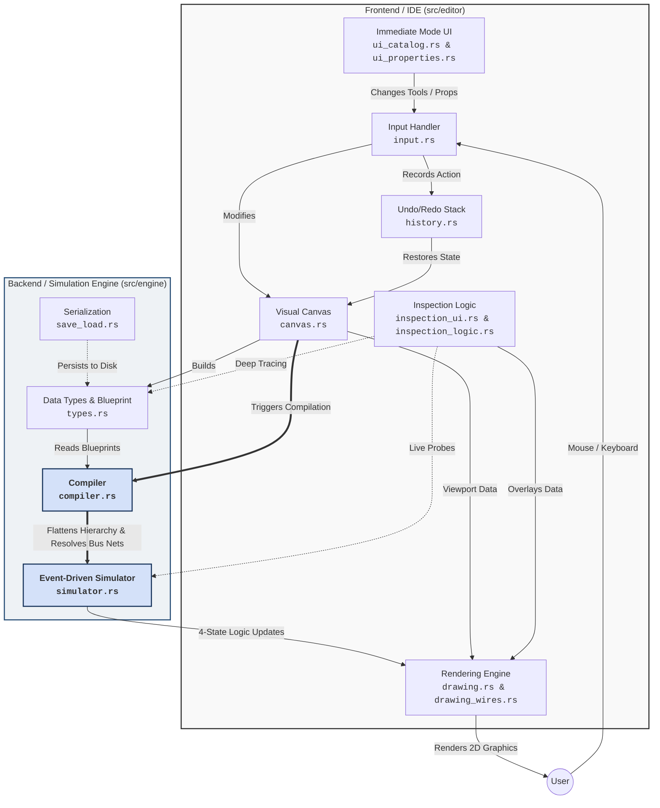

# Digital Logic Simulator

[](https://github.com/Sayanthegamer/digital_logic/actions/workflows/release.yml)
[](https://github.com/Sayanthegamer/digital_logic/actions/workflows/windows.yml)
[](https://github.com/Sayanthegamer/digital_logic/actions/workflows/android.yml)
[](https://www.virustotal.com/)
[](https://www.rust-lang.org)
[]()
[](https://macroquad.rs)

A high-performance, Rust-based Digital Logic Simulator.

This project was built with a specific goal in mind: **to rival and out-perform Sebastian Lague's "Digital Logic Simulator" by a landslide in pure processing power, enabling the creation of fully functional 8-bit and 16-bit CPUs without lag.**

## Why this exists
Many visual logic simulators (including those built in Unity/C#) suffer from Object-Oriented Programming (OOP) bottlenecks. As you abstract chips into nested sub-chips, the simulator has to perform costly tree-traversals or virtual method calls at runtime. Eventually, attempting to run a full CPU in real-time causes massive framerate drops.

**This simulator solves that problem.**

By utilizing a Data-Oriented Design (struct-of-arrays) and a completely flat compilation step, nested chips have **zero runtime overhead**. When you build an ALU from Adders, and a CPU from ALUs, the compiler unwraps the entire hierarchy down to raw, contiguous NAND arrays. The simulation engine only ever processes flat arrays of boolean states, making it incredibly cache-friendly and extremely fast.

## Architecture Overview



## Features
- **Event-Driven Engine**: Gates only calculate when their inputs change, vastly reducing CPU load compared to tick-based simulators.
- **Flat Sub-Chip Compilation**: Build complex nested logic without sacrificing a single frame of performance.
- **Multi-Domain Clocks**: Native support for clocks with localized periods running synchronously.
- **Oscillation Detection**: Prevents the application from freezing when infinite zero-delay feedback loops are accidentally created.
- **Clean UI**: Built with Macroquad (for high-speed 2D canvas rendering) and egui (for the immediate-mode interface), fully modularized for easy expansion and testing.
- **Multi-Platform & Mobile Ready**: Compiles natively to Windows, Android (featuring touch screen pan/zoom controls).


## Documentation
- [Architecture](ARCHITECTURE.md)
- [Design Philosophy](DESIGN.md)
- [System Specifications](SPEC.md)
- [System Requirements](SYSTEM.md)
- [Build & Deployment](DEPLOYMENT.md)

## Quick Start
Ensure you have Rust installed (and Linux dependencies if applicable, see [SYSTEM.md](SYSTEM.md)).

```bash
# Run for testing
cargo run

# Run for maximum performance (recommended when building CPUs)
cargo run --release
```
