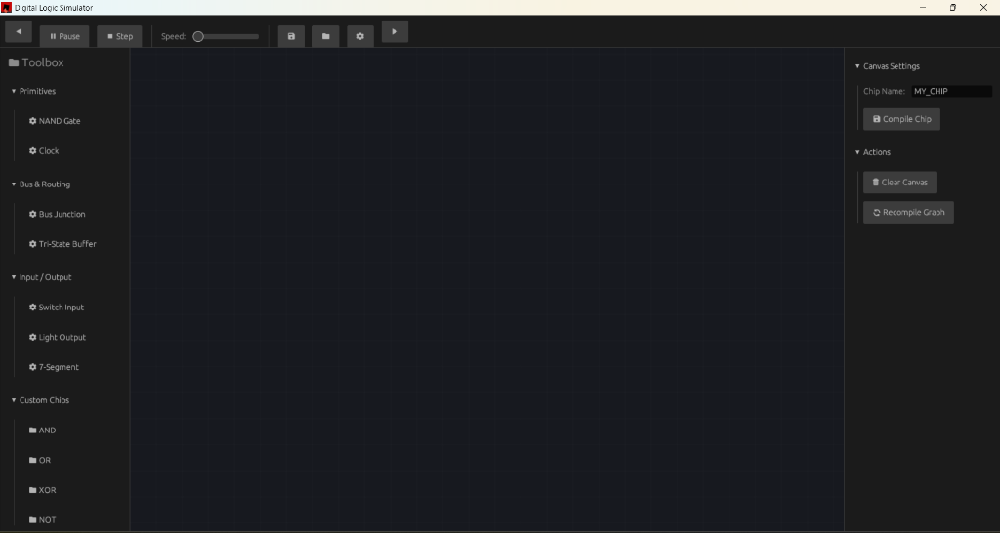
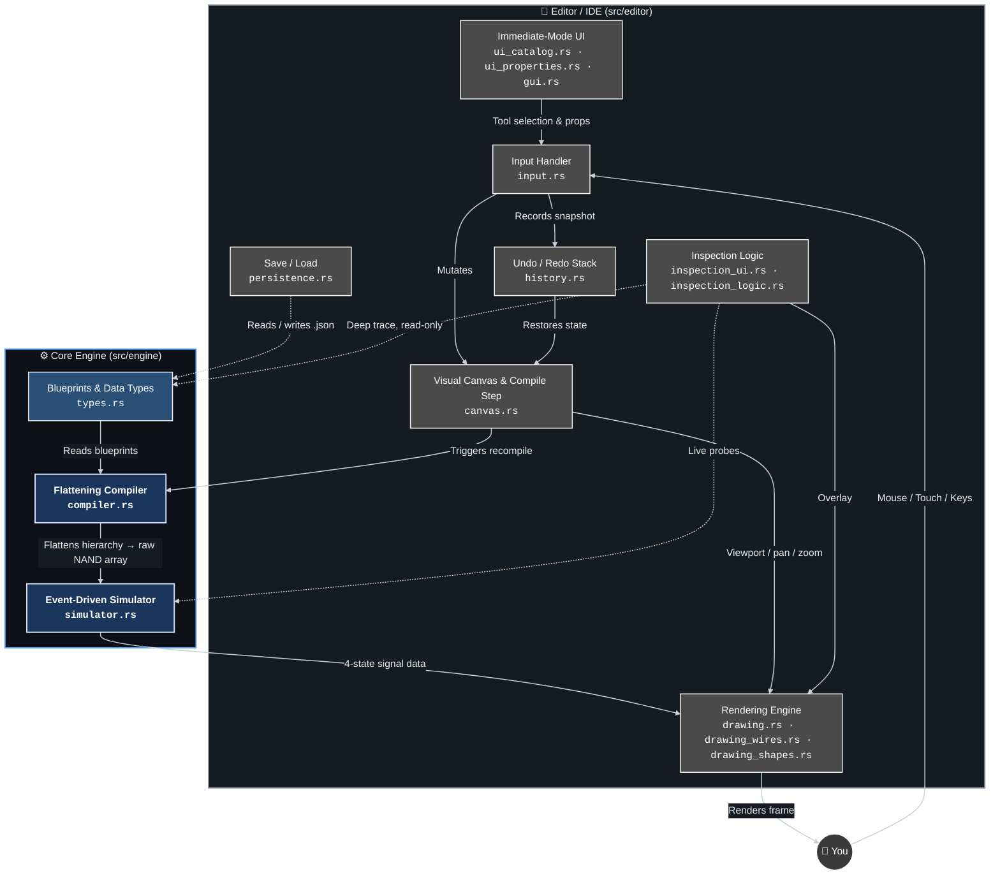
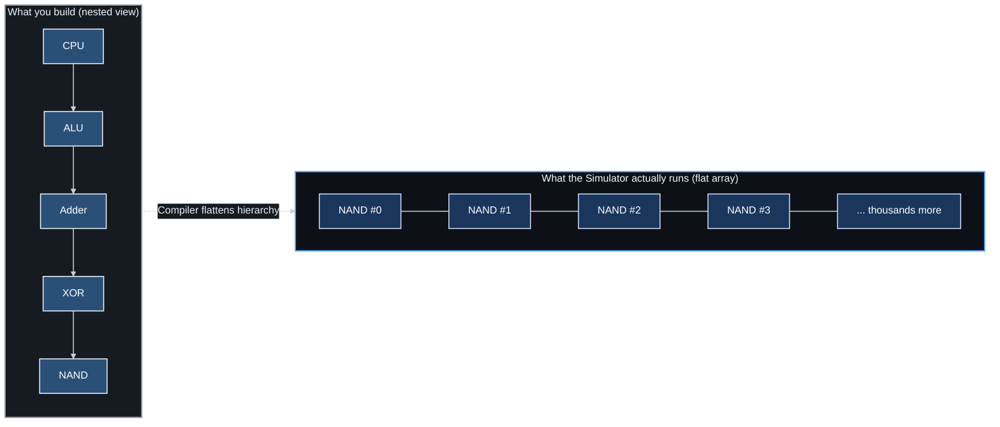
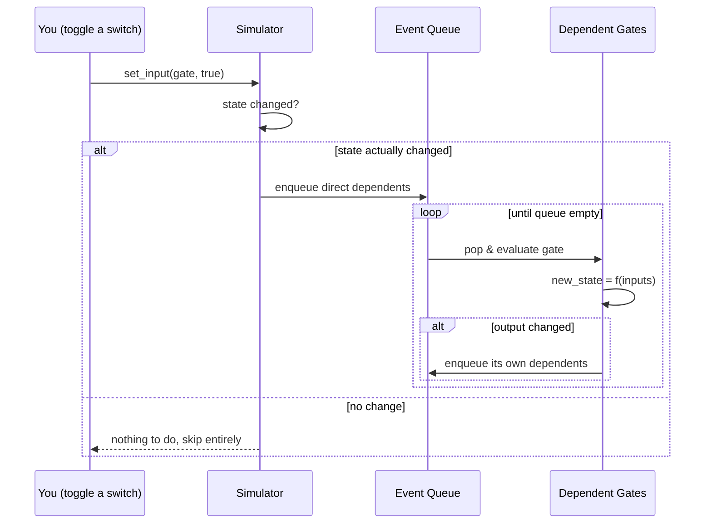
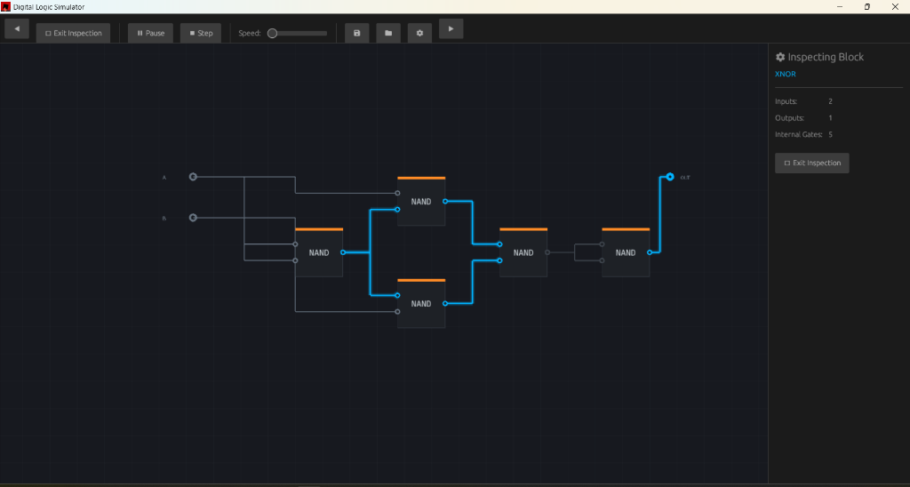
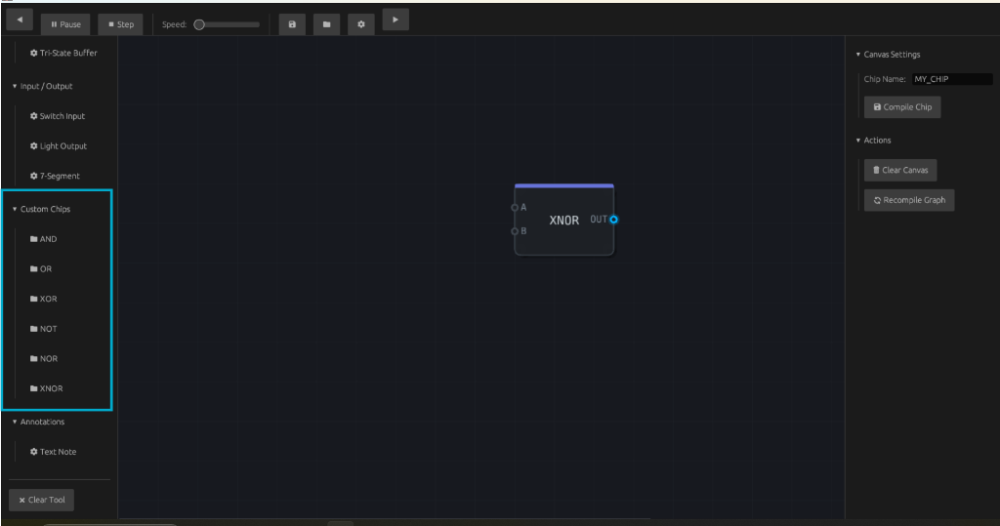
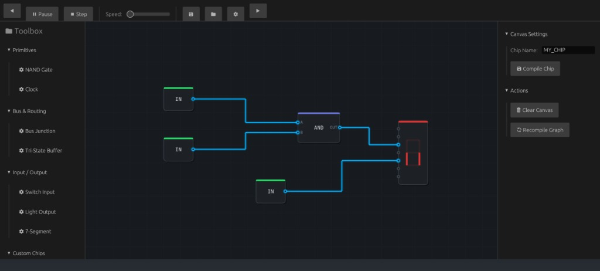

# ⚡ Digital Logic Simulator

[](https://github.com/Sayanthegamer/digital_logic/actions/workflows/release.yml)
[](https://github.com/Sayanthegamer/digital_logic/actions/workflows/windows.yml)
[](https://github.com/Sayanthegamer/digital_logic/actions/workflows/android.yml)
[](https://www.virustotal.com/)
[](https://www.rust-lang.org)
[]()
[](https://macroquad.rs)
[]()

> **Build a computer. From NAND gates. In real time. On a laptop.**

A high-performance, Rust-powered digital logic sandbox where you wire up NAND gates, snap them together into reusable chips, and stack those chips into bigger chips — all the way up to a working CPU, if you're stubborn enough.

<p align="center">
  
</p>

---

## Table of Contents

- [What is this?](#-what-is-this)
- [Why it exists](#-why-it-exists)
- [Feature Tour](#-feature-tour)
- [Architecture, Visually](#-architecture-visually)
- [How the Simulation Actually Works](#-how-the-simulation-actually-works)
- [Quick Start](#-quick-start)
  - [Option A — Just Run the Binary](#option-a--just-run-the-binary-fastest)
  - [Option B — Build From Source](#option-b--build-from-source)
- [Controls Cheat Sheet](#-controls-cheat-sheet)
- [Project Layout](#-project-layout)
- [Platform Support](#-platform-support)
- [Screenshots & Proof of Work](#-screenshots--proof-of-work)
- [Roadmap & Known Limitations](#-roadmap--known-limitations)
- [Documentation Index](#-documentation-index)
- [Contributing](#-contributing)

---

## 🧠 What is this?

The Digital Logic Simulator is a **visual, node-based circuit editor and real-time simulator**. You place primitive components — Inputs, NAND gates, Outputs, Clocks — on an infinite canvas, wire them together, and watch the logic states propagate live as glowing pulses along the wires.

The twist: any circuit you build can be **packaged into a reusable custom chip**. That chip then behaves exactly like a primitive component — you can drop it onto a new canvas, wire it up, and combine it with other chips. Nest chips inside chips inside chips. An `AND` gate becomes part of a `Full Adder`, which becomes part of an `ALU`, which becomes part of a `CPU`. The editor lets you "Look Inside" any chip at any depth to watch the live signal states of the primitives buried deep within it.

It's the same idea popularized by Sebastian Lague's *Digital Logic Sim* and games like *Turing Complete* / *NandGame* — but built from scratch in Rust with a hard focus on **raw simulation throughput**, because nothing kills the fun of building a CPU faster than a simulator chugging at 4 FPS once you cross a few hundred gates.

## 🎯 Why it exists

Most visual logic simulators hit a wall once circuits get big. The usual culprits:

- **Object-Oriented gate graphs** — every gate is a heap-allocated object, every "tick" walks a scattered graph of pointers, and nested sub-chips mean recursive tree-walks or virtual dispatch at runtime.
- **Naive tick-based evaluation** — re-evaluating *every single gate*, *every single frame*, whether or not anything about it changed.
- **Nesting overhead that compounds** — a chip inside a chip inside a chip pays a traversal cost at *every level*, every tick.

This project takes the opposite bet: **Data-Oriented Design**. Struct-of-arrays memory layout, an event-driven propagation queue (gates only evaluate when an input actually changes), and — most importantly — a **compiler pass that flattens the entire nested-chip hierarchy down to raw NAND gates** before simulation ever begins. By the time the simulator runs, it has no concept of "sub-chips" at all — just one big contiguous array of primitives. Nesting depth costs **zero** at runtime.

The goal, stated plainly: **run a real 8-bit (eventually 16-bit) CPU, built entirely out of user-placed NAND gates, in real time, on modest consumer hardware** — no server, no cloud compute, just a laptop CPU core doing what it does best.

## ✨ Feature Tour

| | |
|---|---|
| 🔌 **Event-Driven Simulation** | Gates only re-evaluate when their inputs actually change — not every frame. Oscillation detection stops runaway feedback loops (e.g. an inverter wired to itself) from freezing the app. |
| 🎮 **App Mode Routing** | Navigate seamlessly through a dedicated Main Menu, Project Manager, Settings Overlay, and Credits, keeping the Editor clean and focused. |
| 🧩 **Custom Chips (Sub-Chips)** | Package any circuit into a named, reusable chip with custom input/output labels. Drop it into future circuits like any primitive. |
| 🔍 **Look-Inside Inspection** | Step *into* any chip — even ones nested many layers deep — and watch the live 4-state (Floating / Low / High / Contention) signal on every internal wire, read-only. |
| ⏱️ **Multi-Domain Clocks** | Every clock component has its own independent period. Run a fast CPU clock alongside a slow peripheral clock, both ticking correctly in the same simulation. |
| 🧵 **4-State Logic** | Wires aren't just true/false — they track Floating, Low, High, and Contention states, so you can actually debug bus conflicts and unconnected pins. |
| 🚌 **True Multi-Bit Buses** | Group 2–16 single-bit signals into thick physical Bus lines using dynamic Bus Joiner and Bus Splitter components to keep your layouts clean and uncluttered. |
| 🪢 **Wire Nudging** | Click and drag any wire segment to manually customize its routing and detour around tight spaces. |
| 🔎 **Component Search** | Dynamically filter the parts catalog to find exactly the primitive or custom chip you need without scrolling. |
| ↩️ **Undo / Redo** | Full history stack for canvas edits — place, wire, delete, drag — all reversible. |
| 💾 **Save / Load Projects** | Serializes your entire chip library, canvas, wiring, and annotations to a portable `.json` project file. |
| ✍️ **Text Annotations** | Drop sticky notes on the canvas to document what a section of your circuit actually does (you'll thank yourself later). |
| 📱 **Touch & Mobile Ready** | Pinch-to-zoom, two-finger pan, and a dedicated mobile UI layout — this isn't just a desktop demo bolted onto a phone. |
| 🖥️ **Cross-Platform** | Native builds for Windows, Linux, macOS, and Android — same Rust codebase, same performance characteristics, no Electron in sight. |

## 🏗 Architecture, Visually

The project is split cleanly into two halves that don't know much about each other: a **Core Engine** that only cares about boolean algebra and memory layout, and an **Editor** that only cares about pixels, mouse clicks, and calling into the engine.



### The flattening compiler, in one picture

This is the part that makes deep nesting free. When a chip contains sub-chips, the compiler doesn't keep that hierarchy around at runtime — it recursively resolves every wire back to its ultimate primitive driver *at compile time*, so the simulator only ever sees flat NAND gates.



Nesting depth becomes purely a *user organization* concept. A CPU built from 10,000 nested chip instances runs exactly as fast as 10,000 raw NAND gates laid out flat — because that's literally what it becomes.

## 🔬 How the Simulation Actually Works

The engine models everything as one of four primitive gate types:

| Primitive | Behavior |
|---|---|
| **NAND** | `!(A && B)`. The single universal gate — every other gate you place (AND, OR, XOR, NOT, latches...) compiles down to a network of these. |
| **Input** | A user- or outer-chip-driven source of logic level. |
| **Output** | A sink that reflects whatever drives it. |
| **Clock** | Autonomously flips state after `period` simulation ticks — independently of every other clock in the circuit. |

Instead of a brute-force loop that re-checks every gate every frame, the simulator keeps a `VecDeque<usize>` **event queue**. When an input changes, only its *direct dependents* get pushed onto the queue for re-evaluation — and their state change (if any) cascades to *their* dependents, and so on. Untouched parts of a million-gate circuit cost nothing on a frame where nothing near them changed.



Wires carry a **4-state signal** rather than a plain boolean — `Floating (00)`, `Low (01)`, `High (10)`, and `Contention (11)` — which is what makes bus junctions, tri-state buffers, and "why is this pin doing nothing" debugging actually possible.

To stop a zero-delay feedback loop (e.g. an inverter wired directly back to itself) from freezing the app in an infinite evaluation loop, `propagate_events` accepts a `max_steps` ceiling. Blow past it in a single propagation pass and the engine reports an `Oscillation detected` error instead of hanging your session.

## 🚀 Quick Start

You have two paths in. Pick whichever matches your patience level.

### Option A — Just Run the Binary (fastest)

No Rust, no compiling, no dependencies. Just download and double-click.

1. Head to the **[Releases page](../../releases)**.
2. Grab the build for your platform:
   - 🪟 **Windows** → `logic_simulator.exe`
   - 🤖 **Android** → `logic_simulator.apk` *(you may need to allow "install from unknown sources" the first time)*
3. Run it. That's it — you're placing gates in seconds.

> Every release binary is code-signed with a build attestation and scanned by VirusTotal before publishing (see the badges up top) — you can verify provenance yourself via the GitHub Actions run for that release tag.

### Option B — Build From Source

For when you want to hack on the engine itself, or your platform isn't covered by a pre-built binary (Linux / macOS).

#### 1. Install prerequisites

**Rust toolchain** (all platforms):
```bash
# via rustup — https://rustup.rs
curl --proto '=https' --tlsv1.2 -sSf https://sh.rustup.rs | sh
```

**Linux only** — graphics & audio dependencies for Macroquad/egui:
```bash
sudo apt-get update
sudo apt-get install -y pkg-config libx11-dev libxi-dev libgl1-mesa-dev libasound2-dev libwayland-dev
```

**Windows / macOS** — no extra system packages needed beyond a working Rust toolchain.

#### 2. Clone & run

```bash
git clone https://github.com/Sayanthegamer/digital_logic.git
cd digital_logic

# Debug build — fast to compile, noticeably slower simulation
cargo run

# Release build — REQUIRED for anything beyond toy circuits.
# Compiler optimizations make a massive difference once you're
# simulating hundreds or thousands of gates.
cargo run --release
```

Run the test suite (engine layer has solid coverage — NAND truth tables, SR latches, multi-domain clocks, nested-chip compilation, serialization round-trips):

```bash
cargo test
```

#### 3. (Optional) Build for Android

<details>
<summary>Click to expand Android build steps</summary>

```bash
# Install Android targets
rustup target add aarch64-linux-android armv7-linux-androideabi

# Install cargo-ndk
cargo install cargo-ndk

# Set NDK_HOME to point at your installed NDK, then:
cargo ndk -t arm64-v8a -t armeabi-v7a -o android/app/src/main/jniLibs build --release

cd android
./gradlew assembleRelease
```

Full details, including keystore generation for signed release APKs, live in [`DEPLOYMENT.md`](DEPLOYMENT.md).

</details>

The resulting executable lands at:
- **Linux / macOS:** `./target/release/logic_simulator`
- **Windows:** `.\target\release\logic_simulator.exe`
- **Android:** `.\target\android-artifacts\release\apk\logic_simulator.apk` (local build) or via the Gradle pipeline above

## ⌨️ Controls Cheat Sheet

| Action | Input |
|---|---|
| Place / Connect / Toggle Input | Left Click |
| Move component | Left Click + Drag |
| Delete selection | Right Click, or `Delete` / `Backspace` |
| Zoom | Scroll wheel / pinch |
| Pan | Right-click drag / two-finger drag |
| Select Input tool | `1` or `I` |
| Select Output tool | `2` or `O` |
| Select NAND tool | `3` or `N` |
| Select Clock tool | `4` or `K` |
| Select Text Annotation tool | `5` or `T` |
| Play / Pause simulation | `Space` |
| Recompile canvas | `C` |
| Save project | `Ctrl` + `S` |
| Load project | `Ctrl` + `L` |
| Deselect / cancel tool | `Esc` |
| Undo / Redo | via UI buttons in the properties panel |

## 📁 Project Layout

```
digital_logic/
├── src/
│   ├── engine/              # Pure simulation core — no rendering, no UI
│   │   ├── simulator.rs     # Event-driven propagation engine
│   │   ├── compiler.rs      # Flattens nested chip hierarchies → raw gates
│   │   ├── types.rs         # GateType, ChipBlueprint, Connection, etc.
│   │   └── tests.rs         # Truth-table, latch, clock, compilation tests
│   │
│   ├── editor/               # Macroquad + egui frontend
│   │   ├── canvas.rs         # Visual → simulator compilation bridge
│   │   ├── drawing*.rs       # Wire/component rendering & manhattan routing
│   │   ├── input.rs          # Input entry point and coordinator
│   │   ├── input_*.rs        # Modular phase-specific input handlers (press, drag, release, hover, etc.)
│   │   ├── inspection_*.rs   # "Look Inside" deep-trace overlay
│   │   ├── ui_*.rs           # egui panels: catalog, properties
│   │   ├── history.rs        # Undo / redo snapshot stack
│   │   ├── persistence.rs    # .json project save/load
│   │   └── state.rs          # EngineState / CanvasState / UiState
│   │
│   ├── lib.rs                 # Frame loop glue (draw_gui → update → draw)
│   └── main.rs
│
├── android/                  # Gradle project + JNI glue for the APK build
├── .github/workflows/        # CI: Windows EXE, Android APK, tagged releases
├── ARCHITECTURE.md            # Deep dive on engine/editor separation
├── DESIGN.md                  # Data-oriented design philosophy & rationale
├── SPEC.md                    # Formal spec of primitives & propagation rules
├── SYSTEM.md                  # System requirements & dependency list
├── DEPLOYMENT.md               # Full build & release instructions
└── CHANGELOG.md
```

## 🖥️ Platform Support

| Platform | Status | Notes |
|---|---|---|
| Windows (x86_64) | ✅ Prebuilt binary in Releases | CI-built, attested, VirusTotal-scanned every push to `main` |
| Android (ARM64 / ARMv7) | ✅ Prebuilt APK in Releases | Touch-native UI with a dedicated mobile layout |
| Linux (X11 / Wayland) | ✅ Build from source | Requires the packages listed above |
| macOS (Intel / Apple Silicon) | ✅ Build from source | No extra system deps beyond Rust |

Minimum system requirements: a modern x86_64/ARM64 CPU, ~2 GB RAM, and any GPU capable of OpenGL 3.3 / Metal / DirectX 11 (i.e. basically anything from the last decade). Simulation speed for large circuits is bottlenecked by **single-threaded CPU performance**, not the GPU — the graphics side is deliberately lightweight so it never becomes the limiting factor.

## 📸 Screenshots & Proof of Work

| | |
|---|---|
|  |  |
| *"Look Inside" mode — tracing live 4-state signals through the internal NAND network of an XNOR chip* | *Your growing library of reusable custom chips (AND, OR, XOR, NOT, NOR, XNOR) ready to drop onto the canvas* |

| |
|---|
|  |
| *Wiring up inputs, an AND gate, and a 7-segment display with live signal propagation* |

## 🗺 Roadmap & Known Limitations

In the interest of not oversetting expectations: this is an active, evolving project, and being honest about where it currently stands is more useful than pretending it's a finished product.

- **Works great today** for circuits up to a few hundred gates — adders, latches, ALUs, small counters, simple state machines — all fully real-time, even on modest laptop hardware.
- **Scaling toward a full CPU** (thousands of primitive gates, deep nesting) is an ongoing engineering effort. The current architecture has known chokepoints — a recompile-on-every-edit pattern, some duplicated traversal logic between the editor and compiler, and a couple of struct/state-management issues that get more expensive as circuits grow — that are actively being addressed before that milestone is comfortable to hit.
- **No multi-threaded simulation yet.** The event-driven design is efficient per-core, but everything currently runs on a single simulation thread by design (simplicity over premature parallelism).
- Contributions, bug reports, and "this froze at N gates" reports are genuinely useful data points for prioritizing the next round of engine work.

## 📚 Documentation Index

Each of these goes deeper into one specific slice of the project than this README has room for:

- **[ARCHITECTURE.md](ARCHITECTURE.md)** — the engine/editor split, event-driven simulation, flat compilation, and how the editor UI is modularized.
- **[DESIGN.md](DESIGN.md)** — the data-oriented design philosophy: why NAND-only, struct-of-arrays, and flat compilation beat an OOP object graph.
- **[SPEC.md](SPEC.md)** — the formal specification of primitives, event propagation, oscillation detection, and multi-domain clock timing.
- **[SYSTEM.md](SYSTEM.md)** — supported platforms, minimum requirements, and the full dependency list.
- **[DEPLOYMENT.md](DEPLOYMENT.md)** — step-by-step build & release instructions for desktop and Android, including keystore setup.
- **[SCALE_BREAKING_POINTS.md](SCALE_BREAKING_POINTS.md)** — known performance bottlenecks and quadratic complexity limits in the simulation engine and editor/rendering layers.
- **[CHANGELOG.md](CHANGELOG.md)** — version history, following [Keep a Changelog](https://keepachangelog.com/en/1.0.0/) and [SemVer](https://semver.org/).

## 🤝 Contributing

Issues and pull requests are welcome — whether that's a bug report, a UI polish pass, a new primitive component, or engine-level performance work. If you're planning something substantial (a new gate type, a change to the compiler's tracing logic, etc.), opening an issue first to talk through the approach will save everyone time.

If you build something interesting with this — a working ALU, a tiny CPU, a game of life implementation, anything — open an issue or a discussion with a screenshot. Seeing what people actually build is the best kind of motivation to keep pushing on the performance work described in the roadmap above.

---

<p align="center">
  Built with 🦀 Rust, <a href="https://macroquad.rs">Macroquad</a>, and <a href="https://github.com/emilk/egui">egui</a>.
</p>
